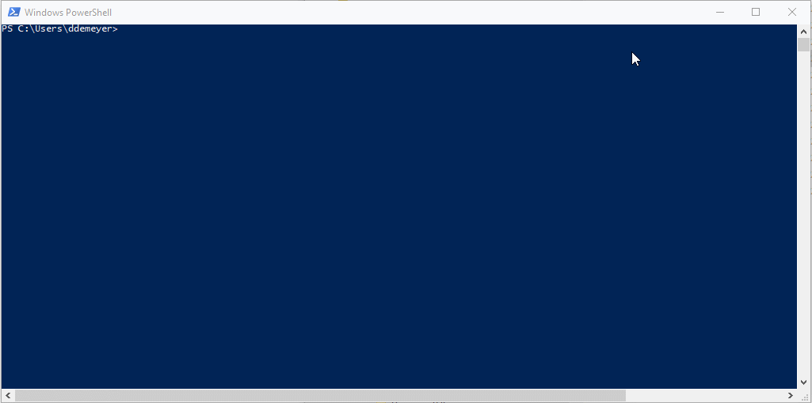
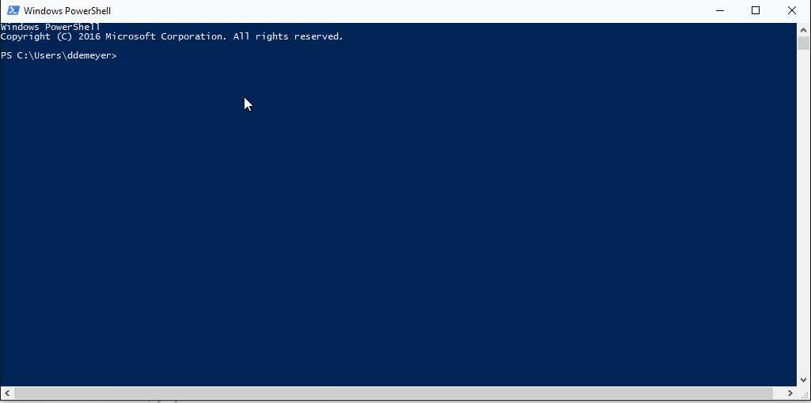

# Release Notes of ISHRemote v0.7

Actual detailed release notes are on [Github](https://github.com/sdl/ISHRemote/releases/tag/v0.7), below some code samples.

Remember
* All C# source code of the ISHRemote library is online at [Source](https://github.com/sdl/ISHRemote/tree/master/Source/ISHRemote/Trisoft.ISHRemote), including handling of WS-Trust protocol ([InfoShareWcfConnection.cs](https://github.com/sdl/ISHRemote/blob/master/Source/ISHRemote/Trisoft.ISHRemote/InfoShareWcfConnection.cs)).
* All PowerShell-based Pester integration tests are located per cmdlet complying with the `*.tests.ps1` file naming convention. See for example [AddIshDocumentObj.Tests.ps1](https://github.com/sdl/ISHRemote/blob/master/Source/ISHRemote/Trisoft.ISHRemote/Cmdlets/DocumentObj/AddIshDocumentObj.Tests.ps1) or [TestIshValidXml.Tests.ps1](https://github.com/sdl/ISHRemote/blob/master/Source/ISHRemote/Trisoft.ISHRemote/Cmdlets/FileProcessor/TestIshValidXml.Tests.ps1)

## Sample - Create Session and List Pending Background Task

Showing implicit IshSession behavior, avoiding explicit `-IshSession` and `-RequestedMetadata` parameters. Less typing and a lot of information. Note that explicit parameters are still possible like before.

```powershell
New-IshSession -WsBaseUrl https://example.com/ISHWS/ -PSCredential Admin
Get-IshLovValue -LovId DSTATUS
Find-IshEDT
Get-IshBackgroundTask | Where-Object -Property status -EQ "Pending"
Get-IshBackgroundTask | Out-GridView
```


## Sample - Descriptive, Basic and All Fields

Showing the implicit defaulting of the `-RequestedMetadata` parameter. By defaulting to `Basic` with matching default table rendering, you get a clean overview of your requested objects. Think about listing User Profiles (`Find-IshUser`) or Event (`Get-IshEvent`).

```powershell
$ishSession = New-IshSession -WsBaseUrl https://example.com/ISHWS/ -PSCredential Admin
$ishSession.DefaultRequestedMetadata = 'Descriptive' # v0.6 and before, only identifying fields
Find-IshOutputFormat 
$ishSession.DefaultRequestedMetadata = 'Basic' # v0.7, new default readable fields
Find-IshOutputFormat
$ishSession.DefaultRequestedMetadata = 'All'  # v0.7, new optional all fields
Find-IshOutputFormat | Select-Object -Property * | Out-GridView
```


## Sample - Descriptive, Basic and All Fields Performance

Showing the performance effect of implicit defaulting of the `-RequestedMetadata` parameter. And also the option to return to the previous behavior. Usability is high for the negliable overhead of retrieving a lot more info, generating read only object properties (`PSNoteProperty`) and table style rendering.

```powershell
$ishSession = New-IshSession -WsBaseUrl https://example.com/ISHWS/ -PSCredential Admin
$metadataFilter = Set-IshMetadataFilterField -Level Lng -Name MODIFIED-ON -FilterOperator GreaterThanOrEqual -Value "01/01/2016" |
                  Set-IshMetadataFilterField -Level Lng -Name MODIFIED-ON -FilterOperator LessThan -Value "01/01/2017" 
$ishSession.DefaultRequestedMetadata = 'Descriptive' # v0.6 and before, only identifying fields
$ishSession.PipelineObjectPreference = 'Off'         # v0.6 and before
(Measure-Command { $o = Find-IshDocumentObj -MetadataFilter $metadataFilter }).TotalMilliseconds
$ishSession.DefaultRequestedMetadata = 'Basic'                # v0.7, new default readable fields
$ishSession.PipelineObjectPreference = 'PSObjectNoteProperty' # v0.7, new default readonly object properties
(Measure-Command { $o = Find-IshDocumentObj -MetadataFilter $metadataFilter }).TotalMilliseconds
$ishSession.DefaultRequestedMetadata = 'All'                  # v0.7, new optional all fields
$ishSession.PipelineObjectPreference = 'PSObjectNoteProperty' # v0.7, new default readonly object properties
(Measure-Command { $o = Find-IshDocumentObj -MetadataFilter $metadataFilter }).TotalMilliseconds
```



## Sample - Validate and Obfuscate Xml and Images

Showing how to create a simple OASIS DITA test file, validate using local DTDs, obfuscate and validate the obfuscated OASIS DITA test file using remote DTDs (over IIS which is very slow, but works).

```powershell
# Create a test file for demo purposes
$ditaTaskFileContent = @"
<?xml version="1.0" ?>
<!DOCTYPE task PUBLIC "-//OASIS//DTD DITA Task//EN" "task.dtd">
<task id="GUID-TASK"><title>Enter the title of your task here.</title><shortdesc>Enter a short description of your task here (optional).</shortdesc><taskbody><prereq>Enter the prerequisites here (optional).</prereq><context>Enter the context of your task here (optional).</context><steps><step><cmd>Enter your first step here.</cmd><stepresult>Enter the result of your step here (optional).</stepresult></step></steps><example>Enter an example that illustrates the current task (optional).</example><postreq>Enter the tasks the user should do after finishing this task (optional).</postreq></taskbody></task>
"@
$taskFilePath = "C:\temp\MyTask.xml"
Set-Content -Path $taskFilePath -Value $ditaTaskFileContent -Encoding UTF8
# validate locally
Test-IshValidXml -XmlCatalogFilePath "C:\InfoShare\WebDITA\Author\ASP\DocTypes\catalog.xml" -FilePath $taskFilePath
# incoming array of fileinfos
Get-ChildItem "C:\temp\MyTask*.xml" |
New-IshObfuscatedFile -FolderPath C:\temp\out\
# resulting obfuscated file
Get-Content C:\temp\out\MyTask.xml
# validate remote which works but is very slow!!
Test-IshValidXml -XmlCatalogFilePath "https://example.com/ISHCM/DocTypes/catalog.xml" -FilePath C:\temp\out\MyTask.xml
```


